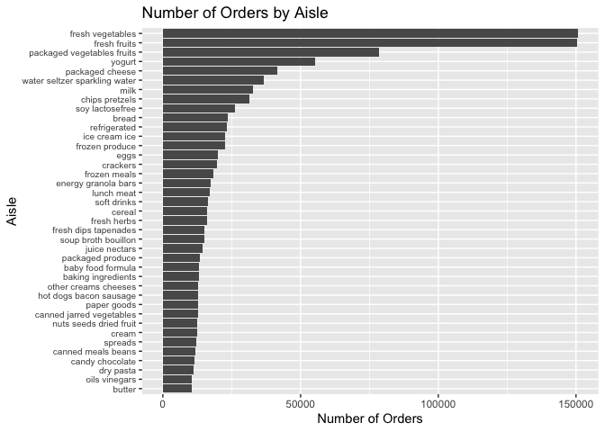
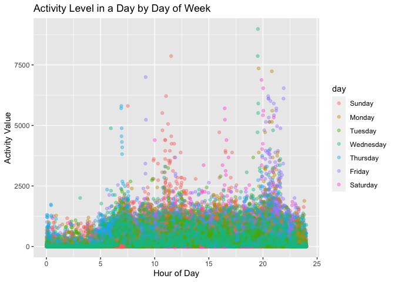

hw3
================
Gunnar
10/19/2021

Load libraries

``` r
library(tidyverse)
library(janitor)
library(readr)
```

**Problem 1**

Loading dataset

``` r
library(p8105.datasets)
data("instacart")
```

Exploring instacart

``` r
names(instacart)
##  [1] "order_id"               "product_id"             "add_to_cart_order"     
##  [4] "reordered"              "user_id"                "eval_set"              
##  [7] "order_number"           "order_dow"              "order_hour_of_day"     
## [10] "days_since_prior_order" "product_name"           "aisle_id"              
## [13] "department_id"          "aisle"                  "department"
summary(instacart)
##     order_id         product_id    add_to_cart_order   reordered     
##  Min.   :      1   Min.   :    1   Min.   : 1.000    Min.   :0.0000  
##  1st Qu.: 843370   1st Qu.:13380   1st Qu.: 3.000    1st Qu.:0.0000  
##  Median :1701880   Median :25298   Median : 7.000    Median :1.0000  
##  Mean   :1706298   Mean   :25556   Mean   : 8.758    Mean   :0.5986  
##  3rd Qu.:2568023   3rd Qu.:37940   3rd Qu.:12.000    3rd Qu.:1.0000  
##  Max.   :3421070   Max.   :49688   Max.   :80.000    Max.   :1.0000  
##     user_id         eval_set          order_number      order_dow    
##  Min.   :     1   Length:1384617     Min.   :  4.00   Min.   :0.000  
##  1st Qu.: 51732   Class :character   1st Qu.:  6.00   1st Qu.:1.000  
##  Median :102933   Mode  :character   Median : 11.00   Median :3.000  
##  Mean   :103113                      Mean   : 17.09   Mean   :2.701  
##  3rd Qu.:154959                      3rd Qu.: 21.00   3rd Qu.:5.000  
##  Max.   :206209                      Max.   :100.00   Max.   :6.000  
##  order_hour_of_day days_since_prior_order product_name          aisle_id    
##  Min.   : 0.00     Min.   : 0.00          Length:1384617     Min.   :  1.0  
##  1st Qu.:10.00     1st Qu.: 7.00          Class :character   1st Qu.: 31.0  
##  Median :14.00     Median :15.00          Mode  :character   Median : 83.0  
##  Mean   :13.58     Mean   :17.07                             Mean   : 71.3  
##  3rd Qu.:17.00     3rd Qu.:30.00                             3rd Qu.:107.0  
##  Max.   :23.00     Max.   :30.00                             Max.   :134.0  
##  department_id      aisle            department       
##  Min.   : 1.00   Length:1384617     Length:1384617    
##  1st Qu.: 4.00   Class :character   Class :character  
##  Median : 8.00   Mode  :character   Mode  :character  
##  Mean   : 9.84                                        
##  3rd Qu.:16.00                                        
##  Max.   :21.00
instacart %>%
  distinct(user_id) %>%
  nrow()
## [1] 131209
instacart %>%
  group_by(department) %>%
  summarise(mean(order_hour_of_day, na.rm = TRUE))
## # A tibble: 21 × 2
##    department      `mean(order_hour_of_day, na.rm = TRUE)`
##    <chr>                                             <dbl>
##  1 alcohol                                            13.7
##  2 babies                                             13.5
##  3 bakery                                             13.5
##  4 beverages                                          13.5
##  5 breakfast                                          13.5
##  6 bulk                                               13.6
##  7 canned goods                                       13.6
##  8 dairy eggs                                         13.6
##  9 deli                                               13.6
## 10 dry goods pasta                                    13.7
## # … with 11 more rows
instacart %>%
  count(aisle, sort = TRUE)
## # A tibble: 134 × 2
##    aisle                              n
##    <chr>                          <int>
##  1 fresh vegetables              150609
##  2 fresh fruits                  150473
##  3 packaged vegetables fruits     78493
##  4 yogurt                         55240
##  5 packaged cheese                41699
##  6 water seltzer sparkling water  36617
##  7 milk                           32644
##  8 chips pretzels                 31269
##  9 soy lactosefree                26240
## 10 bread                          23635
## # … with 124 more rows
```

The instacart dataset has 1,384,617 observations over 15 variables. Key
variables in the data set include product name, department, order hour
of day, and reordered. For example, there were 131,209 distinct user ids
and the mean order hour of the day for products from the alcohol
department was 13.7.

There were 134 aisles and the aisles with the most orders were fresh
vegetables with 150,609 orders, fresh fruits with 150,473 orders, and
packaged vegetables and fruits with 78,493 orders.

Maing a plot of orders by aisle

``` r
insta_plot <- instacart %>%
  group_by(aisle) %>%
  count(aisle) %>%
  filter(n >= 10000) %>%
  ungroup() %>%
  mutate(aisle = forcats::fct_reorder(aisle, n)) %>%
  ggplot(aes(y = aisle, x = n)) +
  geom_col() +
  labs(y = "Aisle", x = "Number of Orders") +
  theme(axis.text.y = element_text(size = 7.5)) +
  ggtitle("Number of Orders by Aisle")

insta_plot
```

<!-- -->

``` r
ggsave("insta_plot.png")
```

After plotting number of orders by aisle, we can see that fruits and
vegetables are by far the most order items, followed by other food items
like yogurt and cheese. Pantry staples like butter, oil, and pasta
appear to be the least ordered.

Making a table of top three items for baking ingredients, dog food care,
and packaged fruits and vegetables.

Steps: 1. filter to relevant aisles 2. group by aisle and identify top 3
rows 3. Add ranking 4. Pivot the table wider and unite products with
purchase counts

``` r
top3_table <- instacart %>%
  filter(aisle == "dog food care" | aisle == "baking ingredients" | aisle == "packaged vegetables fruits") %>%
  select(aisle, product_name) %>%
  group_by(aisle) %>%
  count(product_name, sort = TRUE) %>%
  slice_max(order_by = n, n = 3) %>%
  mutate(rank = rep(1:3, length.out = 3)) %>%
  pivot_wider(names_from = aisle, values_from = c(product_name, n)) %>%
  unite("baking ingredients", 5, 2, sep = " orders of ", remove = TRUE) %>%
  unite("dog food care", 5, 3, sep = " orders of ", remove = TRUE)  %>%
  unite("packaged vegetables and fruits", 5, 4, sep = " orders of ") %>%
  knitr::kable(caption = "Three Most Popular Items by Aisle"
  )
top3_table
```

| rank | baking ingredients              | dog food care                                              | packaged vegetables and fruits      |
|-----:|:--------------------------------|:-----------------------------------------------------------|:------------------------------------|
|    1 | 499 orders of Light Brown Sugar | 30 orders of Snack Sticks Chicken & Rice Recipe Dog Treats | 9784 orders of Organic Baby Spinach |
|    2 | 387 orders of Pure Baking Soda  | 28 orders of Organix Chicken & Brown Rice Recipe           | 5546 orders of Organic Raspberries  |
|    3 | 336 orders of Cane Sugar        | 26 orders of Small Dog Biscuits                            | 4966 orders of Organic Blueberries  |

Three Most Popular Items by Aisle

Making table of mean hour of the day at which Pink Lady Apples and
Coffee Ice Cream are ordered on each day of the week

Steps: 1. Filter to relevant products 2. Change days from numbers to
strings 3. group by day and product and find mean time 4. pivot wider

``` r
hour_table <- instacart %>%
  filter(product_name == "Pink Lady Apples" | product_name == "Coffee Ice Cream") %>%
  mutate(order_dow = factor(order_dow, levels = 0:6, labels = c("sunday", "monday", "tuesday", "wednesday", "thursday", "friday", "saturday"))) %>%
  select(product_name, order_dow, order_hour_of_day) %>%
  group_by(product_name, order_dow) %>%
  summarise(mean_time = mean(order_hour_of_day, na.rm = TRUE)) %>%
  pivot_wider(names_from = order_dow, values_from = mean_time) %>%
  knitr::kable(caption = "Ice Cream and Apple Purchases by Day", digits = 2)
hour_table
```

| product\_name    | sunday | monday | tuesday | wednesday | thursday | friday | saturday |
|:-----------------|-------:|-------:|--------:|----------:|---------:|-------:|---------:|
| Coffee Ice Cream |  13.77 |  14.32 |   15.38 |     15.32 |    15.22 |  12.26 |    13.83 |
| Pink Lady Apples |  13.44 |  11.36 |   11.70 |     14.25 |    11.55 |  12.78 |    11.94 |

Ice Cream and Apple Purchases by Day

**Problem 2**

Loading BRFSS data

``` r
library(p8105.datasets)
data("brfss_smart2010")
```

Cleaning the data set

``` r
brfss <- brfss_smart2010 %>%
  clean_names() %>%
  filter(topic == "Overall Health", response == "Excellent" | response == "Very good" | response == "Good" | response == "Fair" | response == "Poor") %>%
  rename(state = locationabbr) %>%
  rename(location = locationdesc) %>%
  mutate(response = factor(response, labels = c("Poor", "Fair", "Good", "Very good", "Excellent")))
```

Part 2 - answering questions States with 7+ observations in 2010 and
2002

``` r
brfss %>%
  filter(year == 2002) %>%
  group_by(state) %>%
  summarise(n_locations = n_distinct(location)) %>%
  filter(n_locations >= 7)
## # A tibble: 6 × 2
##   state n_locations
##   <chr>       <int>
## 1 CT              7
## 2 FL              7
## 3 MA              8
## 4 NC              7
## 5 NJ              8
## 6 PA             10
brfss %>%
  filter(year == 2010) %>%
  group_by(state) %>%
  summarise(n_locations = n_distinct(location)) %>%
  filter(n_locations >= 7)
## # A tibble: 14 × 2
##    state n_locations
##    <chr>       <int>
##  1 CA             12
##  2 CO              7
##  3 FL             41
##  4 MA              9
##  5 MD             12
##  6 NC             12
##  7 NE             10
##  8 NJ             19
##  9 NY              9
## 10 OH              8
## 11 PA              7
## 12 SC              7
## 13 TX             16
## 14 WA             10
```

In 2002, the states with 7 or more locations in the BRFSS data were CT,
FL, MA, NC, NC, NJ, and PA.

In 2010, the states with 7 or more locations in the BRFSS data were CA,
CO, FL, MA, MD, NC, NE, NJ, NY, OH, PA, SC, TX, and WA.

Spaghetti plot of excellent response by state over time

``` r
spag_plot <- brfss %>%
  filter(response == "Excellent") %>%
  group_by(state, year) %>%
  summarise(avg_data = mean(data_value, na.rm = TRUE)) %>%
  ggplot(aes(x = year, y = avg_data)) +
  geom_line(aes(color = state)) +
  xlab("Year") +
  ylab("Average Data Value") +
  ggtitle("Spaghetti Plot of Average Data Values by State between 2002 and 2010")

spag_plot
```

<!-- -->

``` r
ggsave("spag_plot.png")
```

In the spaghetti plot of average data values by state between 2002 and
2010, many states fluctuate widely from year to year and it is difficult
to discern which states are increasing or decresing in average data
value over time as the 50 lines overlap.

Facet plot of poor to excellent responses in NY in 2002 and 2010

``` r
facet_plot <- brfss %>%
  filter(state == "NY", year == 2002 | year == 2010) %>%
  group_by(state, year) %>%
  ggplot(aes(x = data_value)) +
  geom_histogram() +
  ylab("Count") +
  xlab("Data Value") +
  ggtitle("Distribution of New York Data Values in 2002 and 2010") +
  facet_grid(cols = vars(year))

facet_plot
```

<!-- -->

``` r
ggsave("facet_plot.png")
```

From the facet grid of New York data values in 2002 and 2010, data
values were distributed around 27 with a left skew in 2002. In 2010,
data values were less normally distributed as it appears there were an
equal number of 0 values as 30 values.

**Problem 3** Loading accel data set

``` r
accel_data <- read_csv("Data/accel_data.csv") %>%
  clean_names()
```

Pivoting the accel data set long

``` r
accel_data <- accel_data %>%
  pivot_longer(starts_with("activity"), names_to = "activity", values_to = "value") %>%
  mutate(day_type = ifelse(day == "Friday" | day == "Thursday" | day == "Wednesday" | day == "Tuesday" | day == "Monday", 1, 0)) %>%
  mutate(day = factor(day, levels = c("Sunday", "Monday", "Tuesday", "Wednesday", "Thursday", "Friday", "Saturday"))) %>%
  mutate(day_type = factor(day_type, levels = c(0, 1), labels = c("weekend", "weekday")))
```

In the accel dataset, there are 50,400 observations over 6 variables:
week, day\_id, day, day\_type, activity, and value. The data includes
data on activity over 5 weeks with 72,000 observations per each day of
the week combined over that time period.

Part 2. Creating table of activity grouped by day

Steps: 1. Group data by day 2. Sum all activity per day

``` r
activity_table <- accel_data %>%
  group_by(day) %>%
  summarise(aggregate_activity = sum(value)) %>%
  knitr::kable(caption = "Total Activity by Day", col.names = c("Day", "Total Activity"))

activity_table
```

| Day       | Total Activity |
|:----------|---------------:|
| Sunday    |        1919213 |
| Monday    |        1858699 |
| Tuesday   |        1799238 |
| Wednesday |        2129772 |
| Thursday  |        2091151 |
| Friday    |        2291711 |
| Saturday  |        1369237 |

Total Activity by Day

With total activity aggregated by day of the week, it appears that
activity is highest on Wednesday, Thursday, and Friday, while activity
is at its lowest on Saturday.

Part 3. Creating a plot of activity over time by day of the week

``` r
time_plot <- accel_data %>%
  mutate(activity = parse_number(activity)/60) %>%
  ggplot(aes(x = activity, y = value)) +
  geom_point(aes(color = day), alpha = 0.4) +
  ylab("Activity Value") +
  xlab("Hour of Day") +
  ggtitle("Activity Level in a Day by Day of Week")

time_plot
```

<!-- -->

``` r
ggsave("time_plot.png")
```

In the plot of activity throughout the day stratified by day of week, we
can see that, overall, the activity value is under 2,500 the majority of
the time. There are peaks of activity at around 7 to 10 hours and around
20 hours, with a higher peak of activity in the evening on Fridays than
on other days. The most consistent pattern seen in the chart is that
activity level is uniformly low across the week between about 23 hours
and 5 hours, likely due to the subject sleeping.
